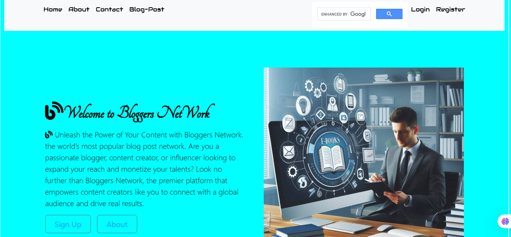

# Bloggers Network



Welcome to **Bloggers Network**, a simple blog post website designed to help users share their thoughts, register, log in, and explore blog content. This project is built using EJS templates for server-side rendering and includes a clean directory structure for easy maintenance.

---

## Project Structure

The project is organized as follows:

```
bloggers_network/
├── views/                     # EJS templates for rendering pages
│   ├── partials/              # Reusable EJS components
│   │   ├── head.ejs           # Head section for all pages
│   │   ├── header.ejs         # Header section for all pages
│   │   └── footer.ejs         # Footer section for all pages
│   ├── about.ejs              # About page
│   ├── blog.ejs               # Blog page
│   ├── contact.ejs            # Contact page
│   ├── index.ejs              # Home page
│   ├── login.ejs              # Login page
│   └── register.ejs           # Registration page
├── public/
|   |__ uploads               # Static assets
│   ├── images/                # Image files
│   ├── pages/                 # Static HTML pages
│   │   └── index.html         # Rendered upon successful login/registration
│   └── styles/                # Stylesheets
│       ├── css/               # Compiled CSS files
│       └── sass/              # SASS source files
```

---

## Features

- **User Authentication**: Users can register and log in to access the blog content.
- **Dynamic Pages**: EJS templates are used to render dynamic content.
- **Responsive Design**: SASS is used for styling, ensuring a responsive and modern design.
- **Reusable Components**: Partials like `head.ejs`, `header.ejs`, and `footer.ejs` make the codebase modular and maintainable.

---

## Setup Instructions

1. **Clone the Repository**:

   ```bash
   git clone https://github.com/joemrnice/bloggers-network-.git
   cd bloggers-network-
   ```

2. **Install Dependencies**:
   Ensure you have Node.js and npm installed. Then, run:

   ```bash
   npm install
   ```

3. **Run the Project**:
   Start the server using:

   ```bash
   npm start
   ```

   The website will be available at `http://localhost:3000`.

4. **Customize Styles**:
   Edit the SASS files in `public/styles/sass/` and compile them to CSS using your preferred SASS compiler.

---

## Technologies Used

- **EJS**: For server-side rendering of dynamic content.
- **Node.js**: Backend runtime environment.
- **Express.js**: Web framework for handling routes and middleware.
- **SASS**: For styling and maintaining CSS efficiently.

---

## Contributing

Contributions are welcome! If you'd like to contribute to this project, please follow these steps:

1. Fork the repository.
2. Create a new branch for your feature or bugfix.
3. Commit your changes and push to your branch.
4. Submit a pull request with a detailed description of your changes.

---

## License

This project is licensed under the MIT License. See the [LICENSE](LICENSE) file for details.

---

## Contact

For any questions or feedback, feel free to reach out:

- **Email**: josephlahaikanumrnice@gmail.com
- **GitHub**: [Joseph Lahai Kanu](https://github.com/joemrnice)

---

Enjoy building and exploring the **Bloggers Network**! 🚀

---
